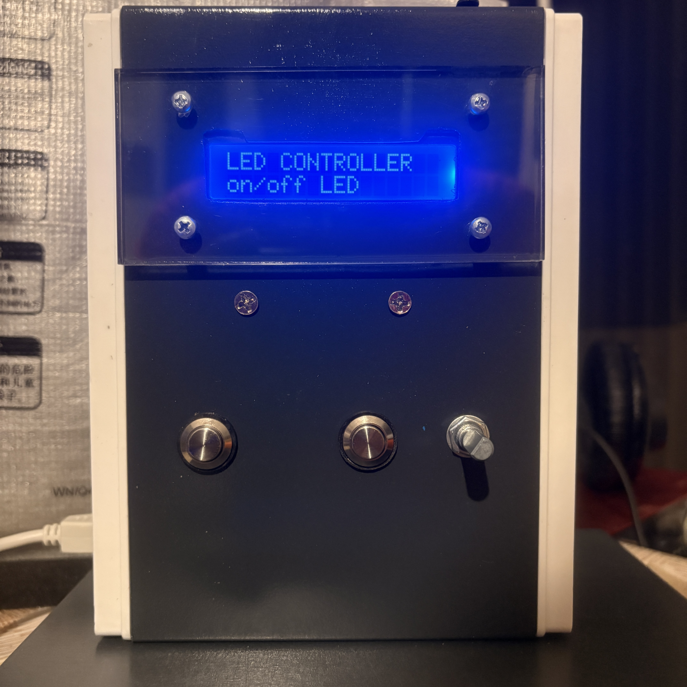
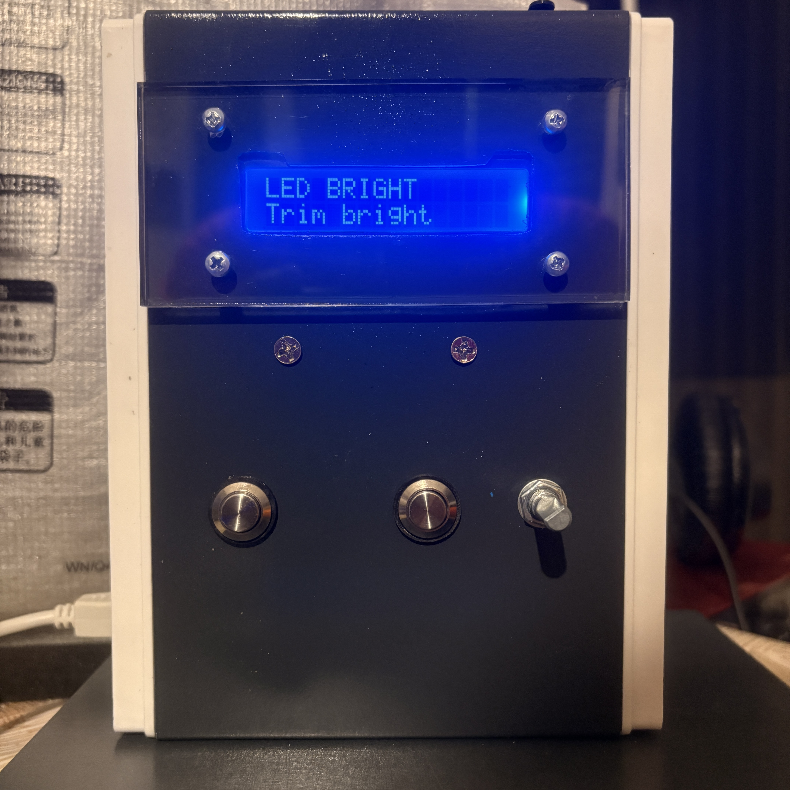
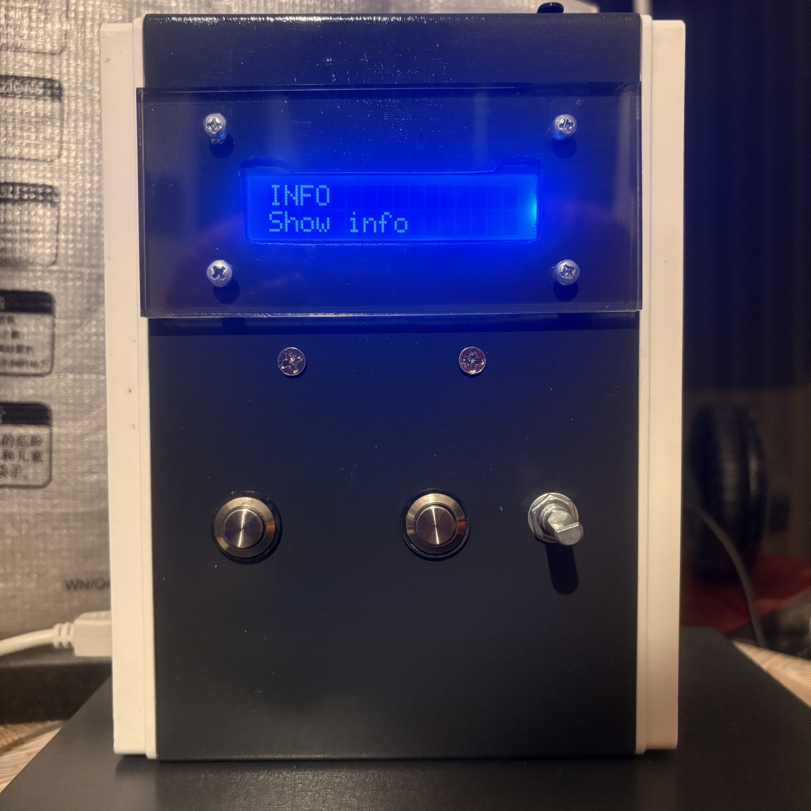
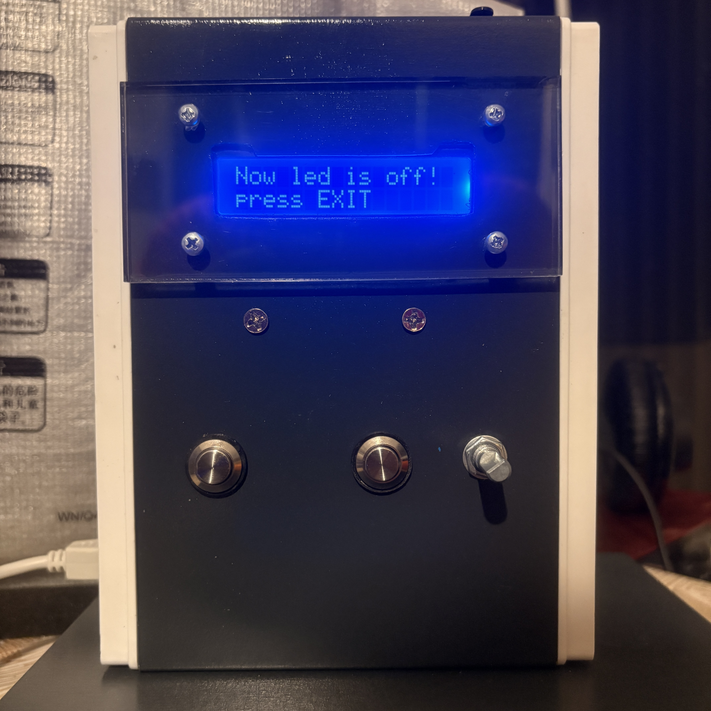
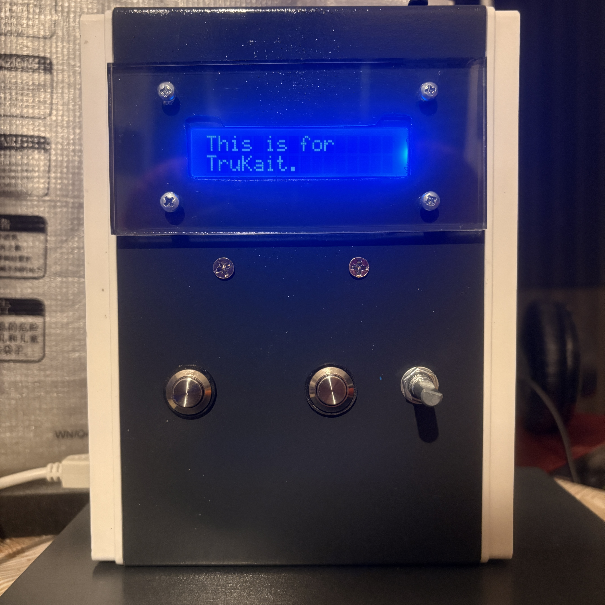

# KaitMenu

Lcd menu library with submenu navigation and function callbacks. 
KaitMenu allows developers to build interactive menu systems for I2C LCD displays. 
Wire and hd44780 libraries required in sketch.

---

## ✨ Features

- ✔️ Multi-level menu navigation  
- ✔️ Custom actions via `void(*callback)()` functions  
- ✔️ Parent/child menu structure  
- ✔️ Supports dynamic return to previous menu  
- ✔️ Clean and easy-to-read API  
- ✔️ Fully compatible with the **hd44780_I2Cexp** LCD driver  
- ✔️ Pure C++ library - dependencies: Wire and hd44780  
- ✔️ Ready for Rotary Encoder, ezButton, or any digital input device (examples included)

---

## 📦 Installation

### **🟢 Method 1 — Arduino IDE Include Library **
Download the .zip from GitHub -> *Sketch -> Include Library -> Add .ZIP Library*.

### **⚪ Method 2 — Arduino IDE Include Library **
Open Library Manager on left column of Arduino IDE -> search "KaitMenu" -> select and install.

### **🔵 Method 3 — Manual Installation **
Copy the **KaitMenu** folder into: ~/Documents/Arduino/libraries.

## 📕 User guide
Open BasicDemo.ino in the examples folder to learn how to use the library. Enjoy!😎

## ⚙️ Requirements

Arduino compatible board, 
I2C LCD based on PCF8574 or compatible, 
Wire and hd44780 library installed.

## 👤 Author

Developed by Livio Bellini. 
Inspiration: Kaitlin Trujillo - "Your soul is in my heart".❤️

## ⭐ Support the project

Leave a star ⭐ on GitHub if you find KaitMenu useful!

## 📸 Images

